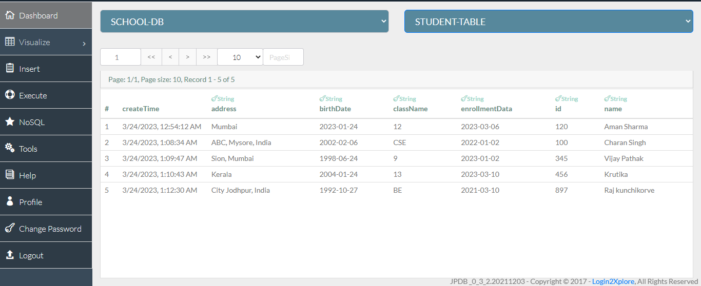
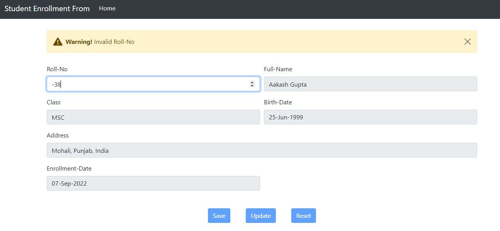
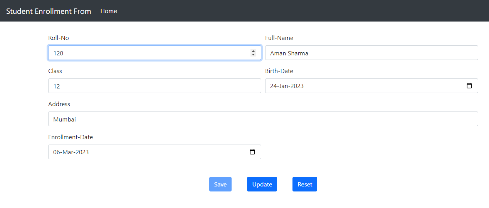
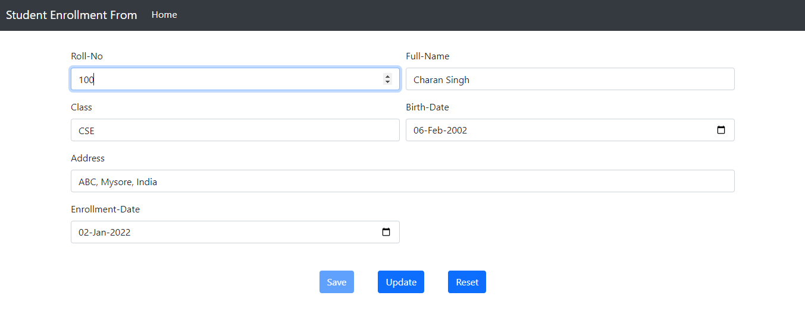
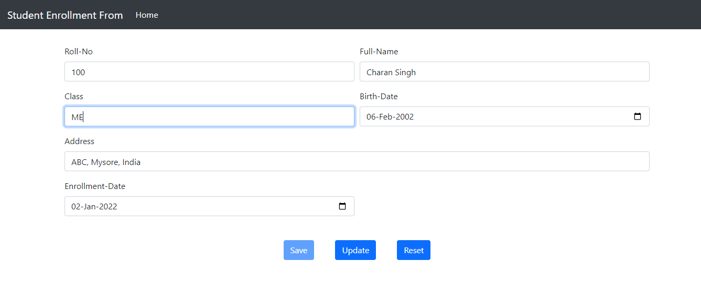
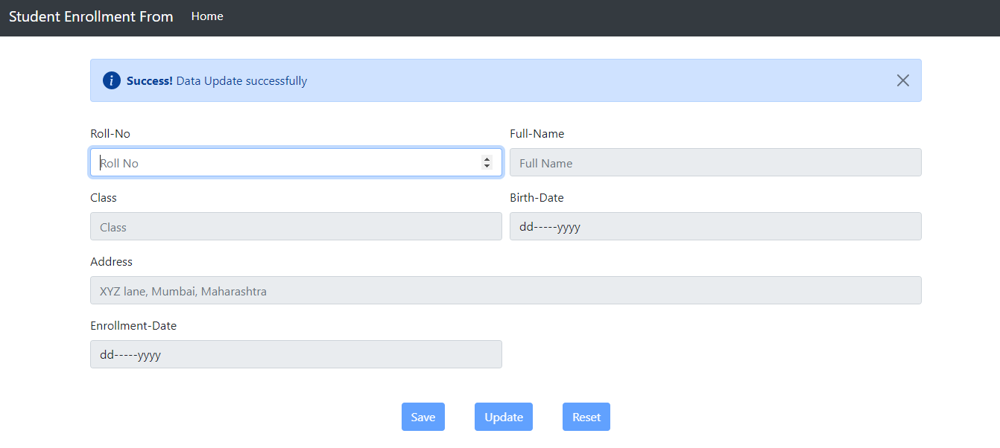
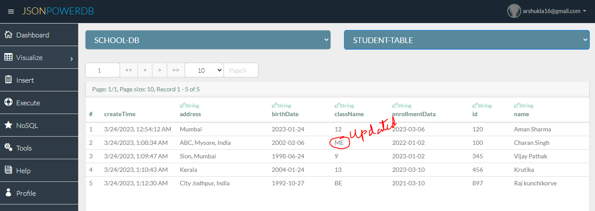
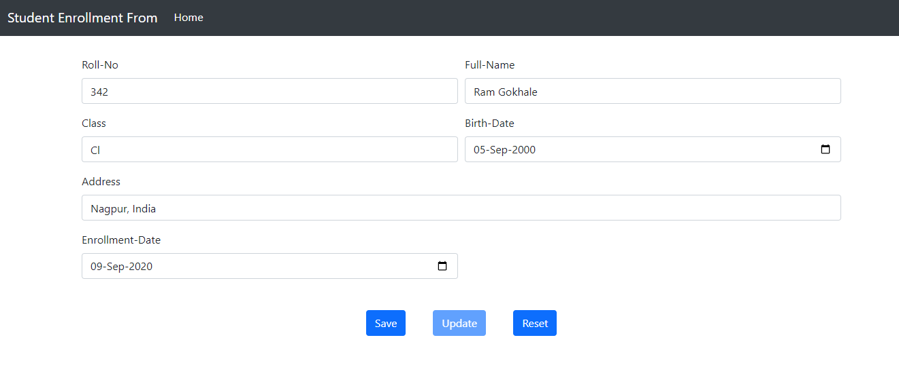

# Student-Enrollment-Form
## Description 
This is a web based html form for student enrollment using JsonPowerDB as Database 
JsonPowerDB is used to perform CURD operation.

# Benefits of using JsonPowerDB
* Simple to use , real time database
* Simplest way to retrieve data in a JSON format.
* No need for defining schema 
* It is built on top of one of the fastest and real-time data indexing engine - PowerIndeX.
* It is low level (raw) form of data and is also human readable.
* It helps developers in faster coding, in-turn reduces development cost.
* Simplest way to retrieve data in a JSON format.
* Backends code is not required for database 
* Querying the database is easy there is no need  of knowledge of SQL commands

# Illustrations:
* **SAVE** : If student roll number is not existed in database then we can fill other field and save in database
* **UPDATE** : when student roll number is already present in database then student information is fetched from database and filled in respective feild then user can UPDATE student information 
* **clear** : By this we can clear all field of form and with this except first field (roll-no) other field are disabled until user enter any roll number
* **Alert** : This website uses disposable Alter prompt using bootstrap

# Screenshots:

# HOW TO USE STEP BY STEP

* **Initially**

We need to enter a roll number 

If roll number is not valid 

If roll number is valid and that roll number is existnig in database

* **Fetching student data using roll number**
  If student already present in database, then all field filled with that student information
  
  
  otherwise, other fields are enabled after user input roll number
  
* **Updation of student details**
  In order to update student details input roll number, and then we can update the student data
  
  
  
  

  

  

* **Adding new student data**

  Enter new roll number and then all other fields are enabled and then after filling student information we can save this data into database only if input is valid
  
  
  
  
  
 * **If input data is not valid**
  
   

  
